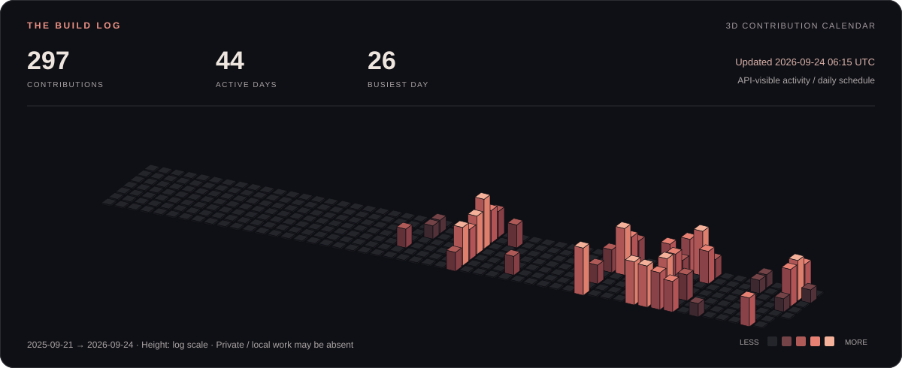

  <a href="#selected-work">
    <picture>
      <source media="(prefers-reduced-motion: reduce)" srcset="assets/header-static.svg">
      
    </picture>
  </a>

  <a href="https://yashveer213.github.io/Yashveer213/">Interactive lab ↗</a> &nbsp; / &nbsp;
  <a href="#about">About</a> &nbsp; / &nbsp;
  <a href="#selected-work">Selected work</a> &nbsp; / &nbsp;
  <a href="#toolbox">Toolbox</a> &nbsp; / &nbsp;
  <a href="#activity">Activity</a> &nbsp; / &nbsp;
  <a href="https://www.linkedin.com/in/yashveer-singh2103/">LinkedIn ↗</a>

<b>Build. Break. Understand. Improve. Repeat.</b>

  <a href="https://yashveer213.github.io/Yashveer213/"><b>Enter the interactive 3D lab ↗</b></a> 
  Orbit the workspace · Select projects · Try browser experiments

### Choose your route

[**Recruiter** — background & selected work](docs/recruiter.md) &nbsp; · &nbsp; [**Developer** — stack & experiments](docs/developer.md) &nbsp; · &nbsp; [**Collaborator** — goals & ways to connect](docs/collaborator.md)

[**Meet the rotatable 3D robot**](docs/robot.md) · [**Public roadmap**](https://yashveer213.github.io/Yashveer213/#roadmap) · [**Build journal**](#build-journal)

## About

I'm **Yashveer Singh**, a computer science student focused on **AI/ML, backend engineering, and developer tools**. I'm building **Aetherion Labs**, starting with Sentinel: an engineering intelligence platform in development.

I like working on the parts of software that have to hold up when something goes wrong: persistence, recovery, provider failures, and the boundary between an AI response and a dependable system.

- **Building:** Sentinel and its integrated AI layer, ANVAS.
- **Exploring:** local-first storage, LLM workflows, software analysis, and privacy-focused applications.
- **Studying:** B.Tech CSE, with an AI/ML specialization, at Amity University Chhattisgarh.

## Selected work

<!-- DASHBOARD:START -->
| Project | Stage | Next goal |
| :--- | :--- | :--- |
| **Sentinel** | In development | Continue implementing and validating the analysis workflows. |
| **Oops!** | Built; evolving | Document a public walkthrough of the existing message flow. |
| **AI-Fi** | Experimental | Continue exploring and validating response and failover scenarios. |
| **IDE conversation recovery** | Design stage | Implement and validate a minimal local event log and restore path. |
<!-- DASHBOARD:END -->

[Explore the filterable roadmap →](https://yashveer213.github.io/Yashveer213/#roadmap) · Stages and next goals are curated project notes; no release dates are implied.

<b>01 / Sentinel — engineering intelligence</b>

 

The flagship project I'm building under Aetherion Labs. Sentinel brings together static analysis and LLM-assisted reasoning in a modular platform, with a hybrid desktop/cloud direction.

**ANVAS** is the integrated AI layer. **Kaizen** is the reasoning and evaluation engine being developed with a collaborator. They are parts of the Sentinel system.

**Stack:** Python · FastAPI · React · Ollama · Docker

**Current focus:** reliable analysis workflows, provider abstraction, and useful explanations that developers can inspect. Sentinel is in development; its broader engineering intelligence capabilities are an ongoing roadmap.

<b>02 / Oops! — encrypted messages, hidden in plain text</b>

 

A communication project that combines client-side encryption with zero-width Unicode steganography. It explores how encrypted messages can be carried inside ordinary-looking text while encryption and decryption happen in the browser.

**Stack:** React · Tailwind CSS · Web Crypto AES-GCM · Argon2id · Supabase

**What interests me:** key derivation, browser cryptography, and making privacy-focused interactions understandable. Hiding a message and encrypting it solve different problems; this project brings both into one flow.

<b>03 / AI-Fi — security response workflows</b>

 

An experimental AI firewall project exploring threat orchestration, response automation, and failover through n8n workflows.

**Focus:** connecting detection signals to controlled response steps and making automated decisions traceable. The work is exploratory; it is not presented as a production security guarantee.

<b>04 / IDE conversation recovery — keeping the history intact</b>

 

A local-first recovery design motivated by lost IDE conversations. The goal is to keep chats, logs, and project history independently of the IDE's own storage.

**Planned architecture:** immutable events, crash-safe writes, checkpoints, session branching, and optional cloud replication that does not overwrite healthy backups with empty or corrupt state.

**Direction:** an open-source tool with workspace-independent session identity and recovery after IDE or machine failure. These are design goals, not a claim of completed implementation.

 

**Some project repositories are private.** This profile shares their purpose and technical direction. Public walkthroughs and demos will be linked as they become available.

## Try the ideas

Three working browser experiments. These are **standalone concept demos**, not recordings of Sentinel or Oops!.

| Unicode studio | Recovery sandbox | Pattern inspector |
| :---: | :---: | :---: |
|  |  |  |
| Hide & reveal text. No encryption. | Replay an in-memory event log. | Run four transparent code checks. |

[Open all playgrounds →](https://yashveer213.github.io/Yashveer213/#playgrounds)

## Toolbox

**Click a technology to see its projects in the lab:**

[Python](https://yashveer213.github.io/Yashveer213/?tech=Python#projects) · [FastAPI](https://yashveer213.github.io/Yashveer213/?tech=FastAPI#projects) · [React](https://yashveer213.github.io/Yashveer213/?tech=React#projects) · [Ollama](https://yashveer213.github.io/Yashveer213/?tech=Ollama#projects) · [Docker](https://yashveer213.github.io/Yashveer213/?tech=Docker#projects) · [Supabase](https://yashveer213.github.io/Yashveer213/?tech=Supabase#projects) · [n8n](https://yashveer213.github.io/Yashveer213/?tech=n8n#projects)

Technologies I've used across my projects:

| Area | Tools |
| :--- | :--- |
| Languages | Python · JavaScript · TypeScript · SQL |
| Backend & data | FastAPI · PostgreSQL · Supabase |
| Interfaces | React · Next.js · Tailwind CSS · Framer Motion |
| AI & automation | Ollama · LLM provider integration · n8n |
| Development | Git · GitHub · Docker · Linux / WSL |

## Activity

Scheduled daily refresh · Last successful update appears in the chart · Private and local work may not be represented.

## Build journal

Recent human-authored commits to this public profile repository. Updated daily; private product development is not inferred from these entries.

<!-- JOURNAL:START -->
- **2026-09-13** · [Switch all profile lab links to verified GitHub Pages hosting](https://github.com/Yashveer213/Yashveer213/commit/b9068ae58f1b507cf5a3ddd2d4475ed3ea2a45ad)
- **2026-09-13** · [Set GitHub Pages canonical URL and trigger profile publication](https://github.com/Yashveer213/Yashveer213/commit/c2ebda1e539cbdd8541219e3bcda1724731bd994)
- **2026-09-13** · [Prepare complete profile lab for GitHub Pages in docs](https://github.com/Yashveer213/Yashveer213/commit/cf2dc91be763a8a1ac0f78fce18760e1aca6e490)
- **2026-09-13** · [Add interactive lab, 3D robot, project routes and automatic public journal](https://github.com/Yashveer213/Yashveer213/commit/0bf3e2be1c8a5283cb77dd5463e33b6752b93dc8)
- **2026-09-12** · [Build animated profile and automated 3D activity chart](https://github.com/Yashveer213/Yashveer213/commit/24500ac6c251af672ebab356932cc7a11d7d672b)
<!-- JOURNAL:END -->

A small note for the curious…

You found the quiet corner. [Read the field notes](docs/field-notes.md), or find the small lab mark in the interactive workspace.

---

  <b>Interested in AI systems, developer tools, or a project I've shared?</b>  
  <a href="https://www.linkedin.com/in/yashveer-singh2103/">Connect on LinkedIn ↗</a>
  &nbsp; · &nbsp;
  <a href="https://github.com/Yashveer213">Explore my GitHub ↗</a>

